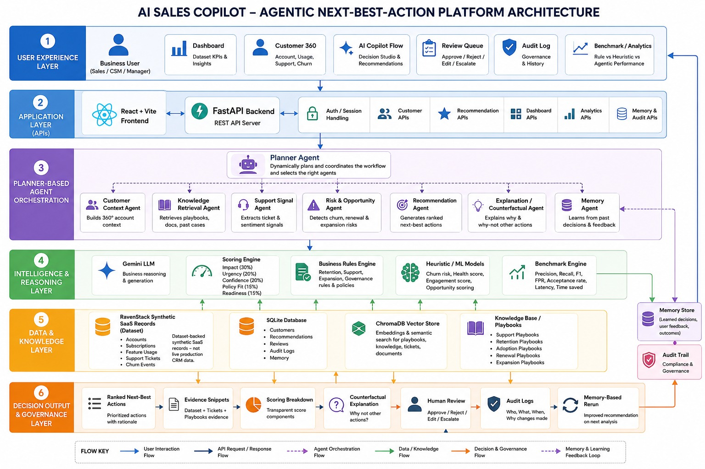
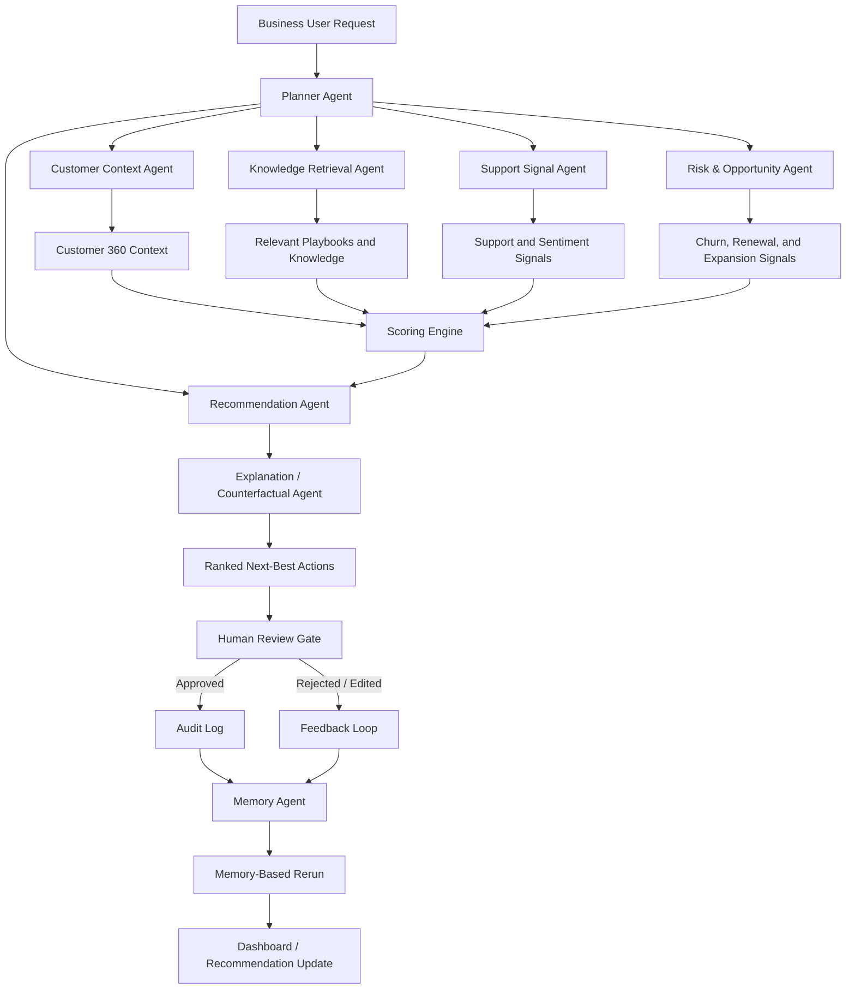

# AI Sales Copilot — Agentic Next-Best-Action Platform

> **Subtitle**: Dataset-backed Agentic Decision Intelligence Platform for B2B SaaS Sales, Customer Success, Retention, and Revenue Risk.

---

## 📖 1. Project Overview

AI Sales Copilot is a reusable Agentic Decision Intelligence Platform that converts customer, subscription, usage, support, churn, and enterprise knowledge signals into explainable next-best-action recommendations. The system uses planner-based agent orchestration, retrieval-augmented knowledge grounding, scoring, counterfactual explanations, human-in-the-loop review, audit logging, and memory-based rerun behavior.

> [!IMPORTANT]
> **Data Scope Notice**: This platform uses **dataset-backed synthetic SaaS records — not live production CRM data**.

---

## 📌 2. Hackathon Problem Alignment

This project addresses the Intelligent Next Best Action Platform challenge by demonstrating:
* **Dynamic planner-based agent orchestration**: A master Planner Agent coordinates the execution sequence of specialized downstream agents.
* **Reusable agent and tool architecture**: Independent, modular agent nodes that consume standardized state patterns.
* **Retrieval across enterprise knowledge sources**: High-efficiency Hybrid RAG utilizing vector and keyword lookup against playbooks.
* **Explainable recommendations with evidence**: Recommendations containing clear confidence scores, mathematical risk breakdowns, and direct playbook citations.
* **Human-in-the-loop review**: Enforced approval gates where human representatives can accept, modify, or reject generated suggestions.
* **Memory from previous interactions**: Decision memory records that influence future recommendation planning loops.
* **Configurable scoring and business rules**: Customizable thresholds for customer health scoring, win probability, and churn risks.
* **Benchmarking and measurable outcomes**: Real-time evaluation engines to compare heuristic systems against full agentic models.

---

## 💼 3. Business Domain & Process

### Business Domain
**B2B SaaS Sales / Customer Success / Revenue Operations**

### Business Process
A sales rep, customer success manager, or manager reviews an account, analyzes customer risk and opportunity signals, receives ranked next-best-action recommendations, reviews supporting evidence, approves or rejects the action, and the system remembers the decision for future recommendations.

---

## ✨ 4. Key Features

* **Dataset Intelligence Dashboard**: Unified view of the health, actions, and historical telemetry of synthetic customer databases.
* **Customer 360 Workspace**: Comprehensive logs, engagement history, and active health scoring breakdowns for accounts.
* **AI Copilot Flow / Decision Studio**: Visual runtime monitor tracking agent planning execution steps.
* **Planner Agent Orchestration**: Central director generating execution paths.
* **Specialized Agent Fleet**: Independent nodes for Customer Context, Knowledge Retrieval, Support Signals, Churn Risk, Recommendation, Explanation, and Memory.
* **Evidence Snippets**: Exact source highlights from playbooks explaining "Why" an action was suggested.
* **Transparent Scoring Breakdown**: Numeric values justifying win rate percentages and customer health metrics.
* **Counterfactual Explanation**: Real-time "What-If" parameter tuning to see how changing parameters alters recommendations.
* **Human Review Queue**: Secure task backlog to verify and sign-off on recommended decisions.
* **Audit Log**: Tamper-evident ledger documenting all system state mutations.
* **Memory-based Rerun**: Long-term context recall that dynamically updates recommendations upon subsequent reruns.
* **Benchmark & Analytics Dashboard**: BI dashboards mapping business impact, forecast curves, and model comparison funnels.

---

## 🏗️ 5. System Architecture



---

## 🧠 6. Multi-Agent Planner Pipeline



### Agent Responsibilities
| Agent | Role | Output |
|---|---|---|
| **Planner Agent** | Dynamically decides which specialized agents should run based on the customer/account context and the requested workflow. | Execution plan and agent activation sequence |
| **Customer Context Agent** | Builds a Customer 360 profile using account, subscription, usage, support, churn, and historical decision data. | Unified customer/account context |
| **Knowledge Retrieval Agent** | Retrieves relevant business knowledge from indexed playbooks, best practices, policies, and product/support documentation using ChromaDB. | Evidence snippets and relevant knowledge chunks |
| **Support Signal Agent** | Analyzes support tickets, satisfaction signals, response/resolution time, and customer frustration patterns. | Support risk signals and sentiment indicators |
| **Risk & Opportunity Agent** | Identifies churn risk, renewal risk, adoption gaps, expansion potential, and revenue opportunities from dataset-backed customer signals. | Risk and opportunity assessment |
| **Recommendation Agent** | Converts agent outputs into ranked next-best-action recommendations for retention, adoption, support recovery, renewal, or expansion. | Candidate next-best actions |
| **Scoring Engine** | Scores recommendations using business impact, urgency, confidence, policy fit, and customer readiness. | Transparent scoring breakdown and final priority score |
| **Explanation / Counterfactual Agent** | Explains why the selected action was recommended and why other possible actions were not prioritized. | Reasoning, evidence summary, and counterfactual explanation |
| **Human Review Gate** | Allows the user to approve, reject, edit, or escalate recommendations before action execution. | Human decision and review status |
| **Audit Log** | Stores decision history, selected recommendation, reviewer decision, timestamp, and governance trail. | Auditable decision record |
| **Memory Agent** | Learns from approved/rejected actions and uses prior decisions to adjust future recommendations for the same customer. | Persistent memory and memory-adjusted rerun behavior |
| **Benchmark Engine** | Compares rule-based, heuristic, and agentic recommendation strategies using measurable evaluation metrics. | Benchmark / analytics results |

### Why this pipeline is agentic

The system does not simply answer a user question like a chatbot. It uses a Planner Agent to coordinate specialized agents, retrieves enterprise knowledge, analyzes customer risk and opportunity signals, generates explainable next-best actions, routes them through human review, records decisions in audit logs, and updates memory so future recommendations improve over time.

---

## ⚙️ 7. How the Platform Works

The platform operates as an explainable, trust-guaranteed recommendation workflow. First, the user or system triggers an audit of a client account. The **Planner Agent** designs a coordination workflow map. A series of specialized collector agents scan CRM context, tickets, transcripts, and document databases. 

The **Recommendation Agent** aggregates these telemetry signals into proposed actions, which are subsequently annotated with confidence levels, logic explanations, alternative choices, and exact RAG text snippets by the **Explanation Agent**. The recommendation is held in the **Human Review Queue**; once a human takes action (approving, editing, or rejecting), an entry is written to the **Audit Log** and stored inside the **Memory Agent**'s context, altering how the system responds if evaluated again.

---

## 🛠️ 8. Tech Stack

### Frontend
* **React** (Component framework)
* **Vite** (Build engine)
* **Tailwind CSS** (Design system & styling)
* **React Flow & Recharts** (Interactive graphs and pipeline visualizations)
* **Lucide React** (Icons)

### Backend
* **Python 3.12** (Core runtime)
* **FastAPI** (REST API layer)
* **Uvicorn** (Asynchronous app server)
* **SQLAlchemy** (Database engine client)
* **SQLite** (Default local transactional state database)
* **ChromaDB** (Vector search client)
* **Gemini API** (LLM orchestrator client)
* **Pandas / Heuristic engines** (Analytics, forecasting, and scoring math)

### Data
* **RavenStack Synthetic SaaS Records** (Accounts, subscriptions, product usage)
* **Engagement Datasets** (Meeting transcript transcripts, customer email histories)
* **Ticketing Systems** (Priority level support tickets, frustration metrics)
* **Knowledge Repository** (SaaS renewal playbooks, sales guides)

---

## 📊 9. Dataset and Knowledge Layer

The core intelligence layer utilizes **dataset-backed synthetic SaaS records — not live production CRM data**. 
1. **Relational CRM Data**: Seeded SQLite tables representing mock accounts, license sizes, usage statistics, active tickets, and emails.
2. **Knowledge Retrieval Base**: Sales playbooks and SOPs are ingested, chunked, embedded via Sentence Transformers, and stored in a local directory inside ChromaDB. Hybrid RAG logic checks these vector embeddings and fallback BM25 keyword indices to pull verified, audit-ready context.

---

## 🚀 10. Local Setup Instructions

* **Docker is optional** and not required for running the local demo.
* **PostgreSQL and Redis are not required** for running the local demo. The demo runs entirely locally using SQLite, local ChromaDB indexes, and Gemini fallback mock states if API keys are not supplied.
* A `.env` file is required to store local keys. **Do not commit `.env`.**

Configure your local `.env` by copying `.env.example`:
```env
DATABASE_URL=sqlite+aiosqlite:///./ai_sales_copilot.db
GEMINI_API_KEY=your_gemini_api_key_here
```

---

## 🐍 11. Backend Run Commands

Run these setup commands in PowerShell from the project root:

```powershell
# Navigate to the backend directory
cd "D:\AI-Sales-Copilot-main\backend"

# Create a virtual environment using Python 3.12
py -3.12 -m venv .venv

# Set execution policy to allow script activation
Set-ExecutionPolicy -Scope Process -ExecutionPolicy Bypass

# Activate the virtual environment
.\.venv\Scripts\Activate.ps1

# Upgrade Python package manager
python -m pip install --upgrade pip

# Install dependencies
pip install -r requirements.txt

# Apply required NumPy compatibility fix
pip install "numpy<2"

# Ingest RavenStack synthetic records and playbooks
python ingest_data.py

# Launch the FastAPI app server
python -m uvicorn app.main:app --reload --port 8000
```

* **Backend URL**: [http://localhost:8000](http://localhost:8000)
* **Interactive API Docs**: [http://localhost:8000/docs](http://localhost:8000/docs)

---

## ⚡ 12. Frontend Run Commands

Run these setup commands in PowerShell from the project root:

```powershell
# Navigate to the frontend directory
cd "D:\AI-Sales-Copilot-main\frontend"

# Install package dependencies bypassing strict peer warnings
npm install --legacy-peer-deps

# Launch the Vite developer server
npm run dev
```

* **Frontend URL**: Use the URL displayed in the terminal output, typically [http://localhost:3000](http://localhost:3000) or [http://localhost:5173](http://localhost:5173).

#### Production Build Verification
To compile and test the production production output, run:
```powershell
npm run build
```

---

## 🎬 13. Demo Flow

Experience the application features sequentially through this path:

```text
Dashboard
→ Dataset Intelligence Layer
→ Customers / Customer 360
→ AI Copilot Flow
→ Generate Next-Best Action
→ Agent reasoning
→ Evidence snippets
→ Scoring breakdown
→ Counterfactual explanation
→ Human Review / Approve
→ Audit Log
→ Memory rerun
→ Benchmark / Analytics
```

---

## 🧱 14. Architecture Walkthrough

```text
Business User
→ React + Vite Frontend
→ FastAPI Backend
→ Planner Agent
→ Specialized Agents
→ Gemini / Scoring / Rules / Benchmark
→ RavenStack / SQLite / ChromaDB / Playbooks
→ Ranked Next-Best Action
→ Human Review
→ Audit Log
→ Memory
→ Improved recommendation on rerun
```

The React + Vite frontend communicates with a FastAPI backend through REST APIs. The backend invokes a Planner Agent that coordinates specialized agents. These agents combine RavenStack synthetic SaaS records, SQLite application state, ChromaDB knowledge retrieval, Gemini LLM reasoning, business rules, scoring logic, and benchmark metrics. The final output is a ranked next-best action with evidence, confidence, scoring, counterfactual reasoning, and human review. Approved actions are stored in audit and memory so future reruns can adjust recommendations instead of repeating the same action.

---

## 🎯 15. Evaluation Mapping

| Hackathon expectation | How this project satisfies it |
|---|---|
| **Agentic AI architecture** | Planner agent coordinates specialized context, risk, knowledge, and recommendation nodes. |
| **Reusability** | Modular agent definitions, clean utility classes, and flexible business rules models. |
| **Memory** | Historic decision metrics stored in long-term memory affect downstream recommendation reruns. |
| **Enterprise knowledge retrieval** | Hybrid vector RAG via ChromaDB index retrieves reference snippets from renewal playbooks. |
| **Explainability** | RAG evidence clips, confidence score metrics, and visual "What-If" simulator widgets. |
| **Human-in-the-loop** | Review queue allows approving, rejecting, editing, and escalating recommendations. |
| **Business reasoning** | Incorporates mock SaaS metrics (support tickets, license usage, email communications). |
| **Measurable outcomes** | Evaluation framework compares standard rules vs heuristic models vs LLM workflows. |

---

## ⚠️ 16. Known Limitations

* Dataset-backed synthetic SaaS records are used for the demo.
* This is not connected to a live CRM in the local version.
* Gemini API key is required for full LLM-powered reasoning.
* If Gemini is unavailable, fallback/heuristic logic may be used depending on implementation.
* Local SQLite is used for hackathon demo simplicity.

---

## 🧹 17. GitHub Cleanup Notes

Make sure **not to commit** local setup state files or API secrets:
* `.env`
* `.venv/`
* `node_modules/`
* `*.db`
* `**pycache__/`
* `dist/`
* `build/`
* `logs`
* API keys

The repository's [.gitignore](file:///d:/AI-Sales-Copilot-main/.gitignore) file already includes:
```gitignore
.env
.venv/
node_modules/
*.db
__pycache__/
.pytest_cache/
dist/
build/
*.log
.DS_Store
Thumbs.db
```

---

**License**: MIT
