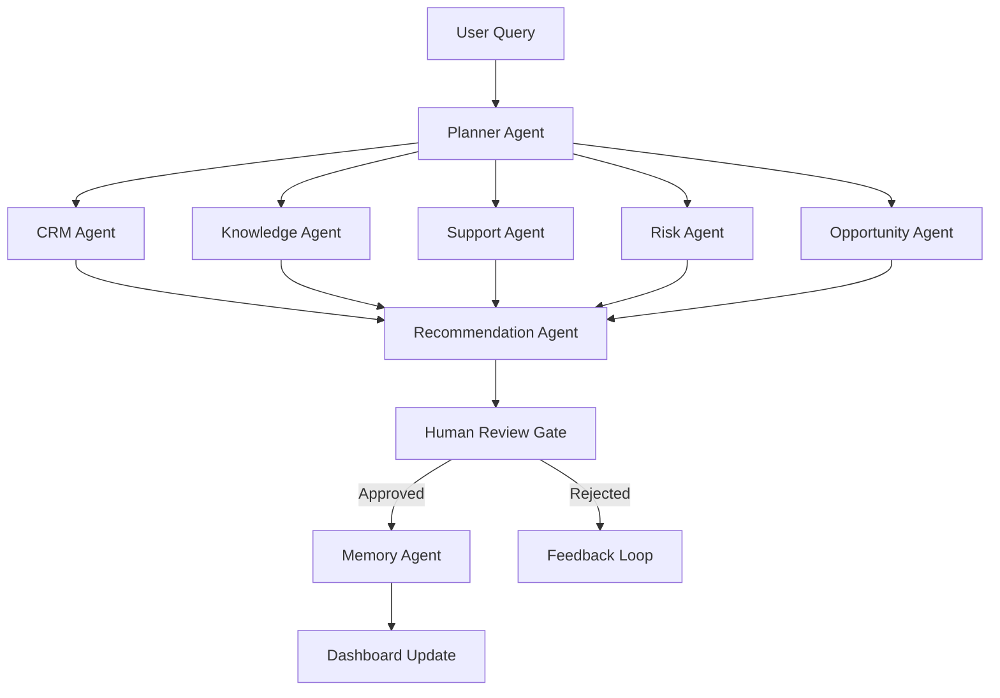

# AI Sales Copilot – Enterprise Next Best Action Platform

> **XLVentures.AI Hackathon Submission** — Multi-agent AI system that generates explainable, auditable sales recommendations with mandatory Human-in-the-Loop approval gates. Built for enterprise-scale deployment.

---

## ✨ Key Differentiators

| Capability | Implementation |
|---|---|
| **Multi-Agent Orchestration** | LangGraph StateGraph with 11 specialized agents running parallel fan-out/fan-in |
| **Human-in-the-Loop** | AI never executes actions autonomously — every recommendation requires human approval |
| **Hybrid RAG** | Semantic (ChromaDB embeddings) + keyword search across uploaded playbooks |
| **Explainable AI** | Every recommendation includes confidence scores, evidence chains, and ROI projections |
| **What-If Simulator** | Real-time probability recalculation when deal parameters change |
| **Zero Trust Security** | PyOTP MFA, ABAC region policies, Fernet encryption, AI prompt injection guardrails |
| **Real-Time Streaming** | Server-Sent Events (SSE) for live agent execution visualization |
| **Executive Reporting** | Styled PDF reports via ReportLab with NBA matrices and compliance statements |

---

## 🏗 Architecture

```
AI-Sales-Copilot/
├── backend/                          # FastAPI Backend (Python 3.11)
│   ├── app/
│   │   ├── api/v1/                   # 19 REST API Routers (109 routes)
│   │   │   ├── auth.py               # JWT authentication & token rotation
│   │   │   ├── security_endpoints.py # MFA, ABAC, audit, PDF export
│   │   │   ├── stream.py             # SSE real-time agent streaming
│   │   │   ├── customers.py          # CRM account management
│   │   │   ├── recommendations.py    # NBA CRUD + status filtering
│   │   │   ├── review.py             # Human-in-the-Loop approval queue
│   │   │   ├── analytics.py          # BI dashboards, funnels, forecasting
│   │   │   ├── knowledge.py          # RAG document management
│   │   │   ├── agent.py              # LangGraph workflow execution
│   │   │   └── ...                   # meetings, emails, tickets, memory, etc.
│   │   ├── agents/                   # 11 LangGraph Agent Nodes
│   │   │   ├── graph/langgraph_builder.py  # StateGraph compiler
│   │   │   └── nodes/               # Individual agent implementations
│   │   ├── core/                     # Config, Security, Logging, Dependencies
│   │   ├── database/                 # SQLAlchemy 2.0 Async ORM
│   │   ├── models/                   # 9 SQLAlchemy Models
│   │   ├── schemas/                  # Pydantic v2 Request/Response Schemas
│   │   ├── services/                 # Business Logic Layer
│   │   │   ├── security_service.py   # Encryption, File Validation, AI Guardrails, TOTP
│   │   │   └── report_service.py     # ReportLab PDF Generation
│   │   ├── rag/                      # Hybrid RAG Pipeline
│   │   ├── redis/                    # Redis Session/Cache Client
│   │   ├── vectorstore/             # ChromaDB Vector Store Client
│   │   ├── repositories/            # Generic Repository Pattern
│   │   └── middleware/              # Request Logging Middleware
│   ├── tests/                       # Pytest Test Suite
│   └── requirements.txt             # 33 production dependencies
├── frontend/                         # React 19 Frontend
│   ├── src/
│   │   ├── App.tsx                   # 8-page SPA with routing
│   │   ├── index.css                 # Tailwind + custom design tokens
│   │   └── main.tsx                  # React DOM entry
│   ├── package.json                  # 16 dependencies
│   └── vite.config.ts               # Proxy to backend API
├── docker/                           # Docker Build Configs
│   ├── Dockerfile.backend
│   ├── Dockerfile.frontend
│   └── nginx.conf
├── docker-compose.yml                # Full Stack Orchestration
├── .github/workflows/                # CI/CD Pipeline
└── docs/                            # Architecture Documentation
```

---

## 🧠 Multi-Agent LangGraph Pipeline



### Agent Responsibilities

| Agent | Role | Output |
|---|---|---|
| **Planner** | Compiles optimal execution plan based on customer context | Agent activation list |
| **CRM** | Retrieves customer profiles, deal history, and pipeline stage | Profile data |
| **Knowledge** | Hybrid RAG search across indexed playbooks and product docs | Relevant document chunks |
| **Transcript** | Processes meeting transcripts for sentiment and key topics | Meeting insights |
| **Email** | Analyzes email communication patterns and competitor mentions | Communication signals |
| **Support** | Evaluates open tickets for frustration triggers and churn signals | Risk indicators |
| **Risk** | Computes retention probability and churn risk scores | Risk assessment |
| **Opportunity** | Identifies upsell, cross-sell, and expansion revenue opportunities | Revenue opportunities |
| **Recommendation** | Aggregates all agent outputs into ranked, explainable NBAs | Action items with ROI |
| **Human Review** | Enforces mandatory approval gates before any action execution | Audit trail entry |
| **Memory** | Persists long-term customer interaction context and preferences | Persistent memory |

---

## 🔐 Security Architecture

| Layer | Implementation |
|---|---|
| **Authentication** | JWT access + refresh tokens with rotation |
| **Multi-Factor Auth** | PyOTP TOTP (Google Authenticator compatible) |
| **Authorization** | Role-Based (RBAC) + Attribute-Based (ABAC) via X-User-Region headers |
| **Encryption at Rest** | Fernet symmetric encryption for sensitive data fields |
| **AI Guardrails** | Regex-based prompt injection detection (9 patterns) |
| **File Security** | Extension whitelist, magic byte validation, size limits |
| **Audit Trail** | Immutable audit log for every state-changing operation |

---

## 🚀 Quick Start

### Prerequisites
- Python 3.11+
- Node.js 18+ (for frontend)
- PostgreSQL 16 / Redis 7 / ChromaDB (or use Docker)

### Using Docker (Recommended)
```bash
cp .env.example .env
docker-compose up --build
```

### Manual Setup

**Backend:**
```bash
cd backend
python -m venv .venv
.venv/Scripts/activate          # Windows
source .venv/bin/activate       # macOS/Linux
pip install -r requirements.txt
uvicorn app.main:app --reload --port 8000
```

**Frontend:**
```bash
cd frontend
npm install
npm run dev
```

### Access Points
| Service | URL |
|---|---|
| Frontend | http://localhost:3000 |
| Backend API | http://localhost:8000 |
| Swagger UI | http://localhost:8000/docs |
| ReDoc | http://localhost:8000/redoc |
| Health Check | http://localhost:8000/health |

---

## 📋 API Endpoints (109 Routes)

### Authentication & Security
| Method | Endpoint | Description |
|---|---|---|
| POST | `/api/v1/auth/register` | Register new user |
| POST | `/api/v1/auth/login` | Login (JWT) |
| POST | `/api/v1/auth/refresh` | Rotate access token |
| POST | `/api/v1/auth/logout` | Invalidate session |
| GET | `/api/v1/auth/me` | Current user profile |
| POST | `/api/v1/auth/mfa/setup` | Generate TOTP secret (Google Authenticator) |
| POST | `/api/v1/auth/mfa/verify` | Validate 6-digit TOTP code |
| GET | `/api/v1/security/audit` | ABAC-protected audit trail |
| GET | `/api/v1/security/export-pdf` | Download executive PDF report |
| GET | `/api/v1/security/events` | Security event alerts |
| GET | `/api/v1/security/sessions` | Active user sessions |
| POST | `/api/v1/security/logout-all` | Revoke all sessions |

### Real-Time Streaming
| Method | Endpoint | Description |
|---|---|---|
| GET | `/api/v1/stream/planner` | SSE stream of agent execution updates |

### Core Resources (CRUD)
| Resource | Prefix | Features |
|---|---|---|
| Customers | `/api/v1/customers` | CRUD + search + health scoring |
| Meetings | `/api/v1/meetings` | CRUD + date range filtering |
| Emails | `/api/v1/emails` | CRUD + full-text search |
| Support Tickets | `/api/v1/support-tickets` | CRUD + priority/status filtering |
| Knowledge Base | `/api/v1/knowledge` | CRUD + file upload + RAG indexing |
| Recommendations | `/api/v1/recommendations` | CRUD + status lifecycle |
| Memories | `/api/v1/memories` | CRUD + type filtering |
| Users | `/api/v1/users` | Admin CRUD |

### Analytics & AI
| Method | Endpoint | Description |
|---|---|---|
| GET | `/api/v1/dashboard/stats` | Executive KPI metrics |
| GET | `/api/v1/analytics/summary` | BI dashboard summary |
| GET | `/api/v1/analytics/funnel` | Sales funnel breakdown |
| GET | `/api/v1/analytics/forecast` | Revenue time-series forecast |
| POST | `/api/v1/agent/execute` | Trigger LangGraph multi-agent workflow |
| POST | `/api/v1/review/approve/{id}` | Approve recommendation |
| POST | `/api/v1/review/reject/{id}` | Reject recommendation |
| GET | `/api/v1/search/global` | Cross-entity semantic search |

---

## 🧪 Testing

```bash
cd backend
.venv/Scripts/python -m pytest tests/ -v
```

### Test Coverage
| Test File | Tests | Description |
|---|---|---|
| `test_security_governance.py` | 6 | Encryption, file validation, guardrails, TOTP, PDF generation |

---

## 🛠 Tech Stack

| Layer | Technology |
|---|---|
| **Backend** | FastAPI 0.115, Python 3.11, SQLAlchemy 2.0 (async), Pydantic v2 |
| **Database** | PostgreSQL 16, Redis 7, ChromaDB 0.5 |
| **Authentication** | JWT (python-jose), bcrypt, PyOTP 2.10 |
| **AI/ML** | LangGraph 0.2.60, LangChain 0.3.13, Sentence Transformers 3.3 |
| **LLM Providers** | Google Gemini 1.5 Pro, OpenAI GPT-4o (configurable) |
| **RAG** | ChromaDB + all-MiniLM-L6-v2 embeddings + keyword fallback |
| **Frontend** | React 19, TypeScript 5, Vite 5, TailwindCSS 3.4 |
| **Visualization** | Recharts 2.12, ReactFlow 11.10, Lucide React icons |
| **Reports** | ReportLab 5.0 (styled executive PDF generation) |
| **Streaming** | SSE-Starlette 2.1 (Server-Sent Events) |
| **DevOps** | Docker, Docker Compose, Nginx, GitHub Actions |

---

## 📊 Database Models

| Model | Key Fields | Purpose |
|---|---|---|
| **User** | email, role, hashed_password | Authentication & RBAC |
| **Customer** | company_name, health_score, win_probability, annual_revenue | CRM with AI scoring |
| **Meeting** | transcript, sentiment, action_items | Meeting intelligence |
| **Email** | subject, content, direction, sentiment | Communication tracking |
| **SupportTicket** | priority, status, frustration_score | Issue management |
| **KnowledgeDocument** | title, file_path, chunk_count | RAG document store |
| **Recommendation** | action, confidence, roi_estimate, status | AI-generated NBAs |
| **Memory** | memory_type, content, context | Long-term customer memory |
| **AuditLog** | action, entity, user_id, timestamp | Immutable audit trail |

---

## 📌 XLVentures.AI Hackathon

### 3-5 Minute Demo Script
1. **Login & MFA Setup**: Log in using credential profiles and configure Google Authenticator TOTP tokens on the security panel.
2. **Knowledge Ingestion (RAG)**: Navigate to the Knowledge Center and upload product guides or playbooks.
3. **Execute Planner (SSE)**: Trigger the AI Copilot Flow for a target client. Observe live streaming terminal events as nodes process.
4. **Approve Action**: View the explainability matrix, confidence breakdown charts, and alternatives comparison, and click "Approve & Execute".
5. **PDF Report Export**: Export the auditable executive report package as a ReportLab PDF format document.

### Enterprise Demo Mode
* Activates automatically if `GEMINI_API_KEY` is not present or if the API connection rate limits / errors.
* Returns a valid structured JSON output matching Pydantic validator schemas to guarantee zero-downtime presentations.

### Known Limitations
* **Gemini API Key**: Essential for live reasoning models, defaults to Demo Mode if key is empty.
* **Redis Cache**: Optional; will bypass caching if Redis server is not reachable.
* **ChromaDB**: Defaults to in-memory mode if HTTP client ports are not exposed.

---

**License**: MIT
