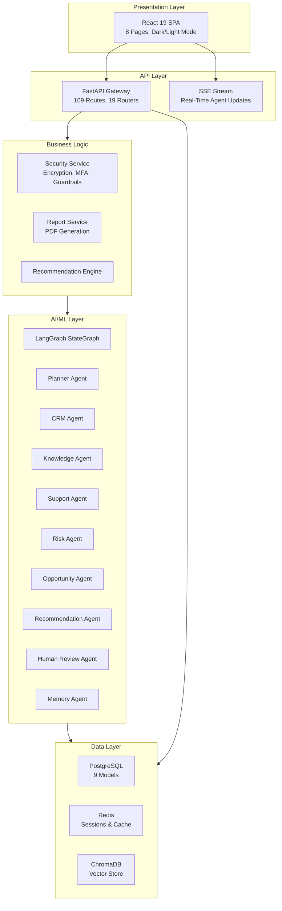
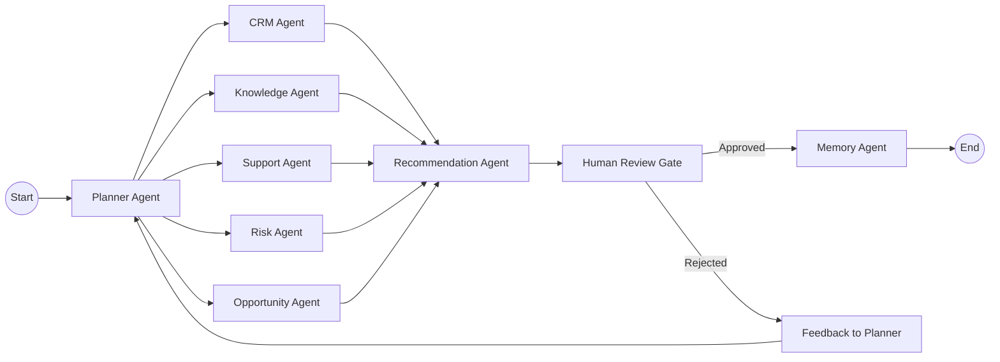
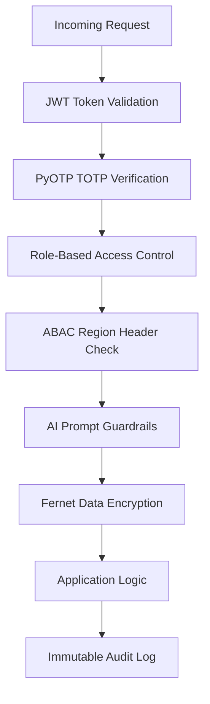
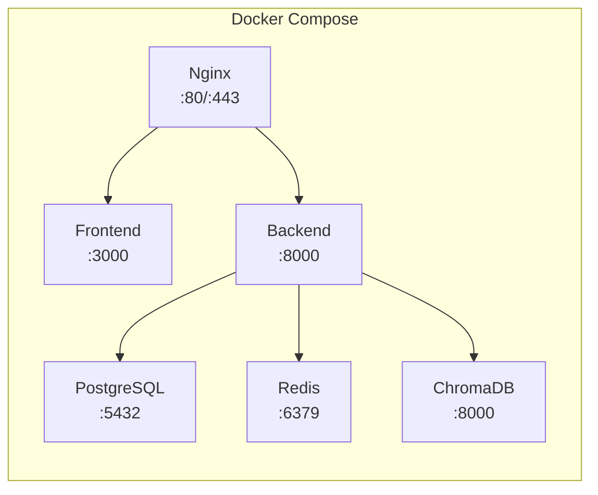

# AI Sales Copilot — Architecture Reference

> Enterprise Next Best Action Platform — Multi-Agent AI with Human-in-the-Loop

---

## System Overview

AI Sales Copilot is an enterprise B2B sales intelligence platform that uses a multi-agent AI pipeline (built on LangGraph) to generate explainable, confidence-scored Next Best Action (NBA) recommendations. Every recommendation must be approved by a human before execution — AI never acts autonomously.

---

## High-Level Architecture

---

## Technology Stack

| Layer | Technology | Version |
|---|---|---|
| Runtime | Python | 3.11 |
| Web Framework | FastAPI | 0.115.0 |
| ORM | SQLAlchemy (async) | 2.0.35 |
| Validation | Pydantic | 2.9.0 |
| Database | PostgreSQL | 16 |
| Cache/Session | Redis | 7 |
| Vector Store | ChromaDB | 0.5.0 |
| Agent Orchestration | LangGraph | 0.2.60 |
| LLM Framework | LangChain | 0.3.13 |
| LLM Providers | Google Gemini 1.5 Pro, OpenAI GPT-4o | Configurable |
| Embeddings | Sentence Transformers (all-MiniLM-L6-v2) | 3.3.1 |
| MFA | PyOTP | 2.10.0 |
| PDF Reports | ReportLab | 5.0.0 |
| Real-Time | SSE-Starlette | 2.1.3 |
| Frontend | React 19 + TypeScript 5 + Vite 5 | Latest |
| Styling | TailwindCSS | 3.4 |
| Charts | Recharts | 2.12 |
| Agent Visualization | ReactFlow | 11.10 |
| Containers | Docker + Docker Compose | Latest |
| Reverse Proxy | Nginx | Alpine |

---

## Multi-Agent Pipeline

### LangGraph StateGraph Execution Flow

### Agent Node Specifications

| # | Agent | Responsibility | Input | Output |
|---|---|---|---|---|
| 1 | **PlannerAgent** | Determines which agents to activate based on customer context | Customer ID, query | Agent activation plan |
| 2 | **CRMAgent** | Retrieves profiles, deal history, pipeline stage, and revenue data | Customer ID | Structured profile object |
| 3 | **KnowledgeAgent** | Hybrid RAG search (semantic + keyword) across indexed documents | Query text | Ranked document chunks |
| 4 | **TranscriptAgent** | Extracts topics, sentiment, and action items from meeting transcripts | Customer ID | Meeting insights |
| 5 | **EmailAgent** | Analyzes email patterns, competitor mentions, and communication frequency | Customer ID | Communication signals |
| 6 | **SupportAgent** | Evaluates open tickets for frustration signals and churn indicators | Customer ID | Frustration risk score |
| 7 | **RiskAgent** | Computes churn probability and retention scores using multi-signal analysis | All agent outputs | Risk assessment (0–100) |
| 8 | **OpportunityAgent** | Identifies upsell, cross-sell, and expansion revenue targets | Profile + history | Revenue opportunities |
| 9 | **RecommendationAgent** | Synthesizes all outputs into ranked, explainable next-best-actions | All agent outputs | NBA list with ROI |
| 10 | **HumanReviewAgent** | Enforces mandatory approval gate — blocks autonomous execution | NBA list | Approval status |
| 11 | **MemoryAgent** | Persists long-term interaction context and customer preferences | Approved actions | Memory records |

---

## Security Architecture

### Zero Trust Layers

| Security Layer | Implementation | Details |
|---|---|---|
| Authentication | JWT (python-jose) | Access + refresh token rotation |
| Multi-Factor Auth | PyOTP 2.10 | TOTP codes via Google Authenticator |
| Role Authorization | RBAC middleware | admin, manager, sales_rep roles |
| Attribute Authorization | ABAC headers | `X-User-Region` geo-fence enforcement |
| Data Encryption | Fernet (cryptography) | Symmetric encryption for PII fields |
| AI Guardrails | Regex patterns (9 rules) | Prompt injection, jailbreak detection |
| File Security | Extension whitelist + magic bytes | PDF header validation, 10MB size cap |
| Audit Trail | AuditLog model | Immutable log of every state change |

---

## API Router Registry (19 Routers, 109 Routes)

| Router | Prefix | Tag | Key Endpoints |
|---|---|---|---|
| auth | `/auth` | Authentication | register, login, refresh, logout, me, mfa/setup, mfa/verify |
| security_endpoints | — | Security & Compliance | audit, export-pdf, events, sessions, logout-all |
| stream | — | Live Streaming | stream/planner (SSE) |
| customers | `/customers` | Customers | CRUD + search + health scoring |
| meetings | `/meetings` | Meetings | CRUD + date range filter |
| emails | `/emails` | Emails | CRUD + full-text search |
| support_tickets | `/support-tickets` | Support Tickets | CRUD + priority/status filter |
| knowledge | `/knowledge` | Knowledge Base | CRUD + file upload + RAG index |
| recommendations | `/recommendations` | Recommendations | CRUD + status lifecycle |
| memories | `/memories` | Memory | CRUD + type filter |
| users | `/users` | Users | Admin CRUD |
| audit_logs | `/audit-logs` | Audit Logs | list, recent activities |
| dashboard | `/dashboard` | Dashboard | stats, KPI metrics |
| analytics | `/analytics` | Analytics | summary, funnel, forecast |
| uploads | `/uploads` | File Uploads | multipart upload |
| search | `/search` | Search | global, per-entity search |
| review | `/review` | HITL Review | approve, reject, escalate |
| memory_endpoints | — | Enterprise Memory | timeline, context queries |
| agent | — | AI Agents | execute workflow, status |

---

## Data Models (PostgreSQL)

| Model | Key Columns | Purpose |
|---|---|---|
| **User** | id, email, hashed_password, role, is_active | Authentication & RBAC |
| **Customer** | id, company_name, health_score, win_probability, annual_revenue, current_stage | CRM with AI-computed scoring |
| **Meeting** | id, customer_id, transcript, sentiment, summary, action_items | Meeting intelligence |
| **Email** | id, customer_id, subject, content, direction, sentiment | Communication tracking |
| **SupportTicket** | id, customer_id, title, priority, status, frustration_score | Issue management |
| **KnowledgeDocument** | id, title, content, file_path, doc_type, chunk_count | RAG document store |
| **Recommendation** | id, customer_id, recommendation, confidence, roi_estimate, status | AI-generated NBAs |
| **Memory** | id, customer_id, memory_type, content, context | Long-term customer memory |
| **AuditLog** | id, user_id, action, entity, entity_id, timestamp | Immutable audit trail |

---

## Deployment Architecture

### Docker Services

| Service | Image | Port | Purpose |
|---|---|---|---|
| backend | Custom (Dockerfile.backend) | 8000 | FastAPI application server |
| frontend | Custom (Dockerfile.frontend) | 3000 | Vite dev / Nginx prod |
| postgres | postgres:16-alpine | 5432 | Primary database |
| redis | redis:7-alpine | 6379 | Session store & cache |
| chromadb | chromadb/chroma:latest | 8001 | Vector embeddings store |
| nginx | nginx:alpine | 80/443 | Reverse proxy & TLS termination |

---

## Frontend Pages

| Page | Route | Features |
|---|---|---|
| Executive Dashboard | `/` | KPI cards, revenue/pipeline chart, activity feed |
| Customer Portfolio | `/customers` | Account table, detail view, timeline, memory panel |
| Human Review Queue | `/review` | NBA cards, approve/reject, what-if simulator |
| AI Copilot Flow | `/copilot` | LangGraph pipeline visualizer, terminal stream |
| Knowledge Center | `/knowledge` | Document upload, indexed assets list |
| BI Analytics | `/analytics` | Funnel chart, pie chart, radar chart, forecast |
| Security Console | `/security` | TOTP enrollment, ABAC config, security events |
| System Settings | `/settings` | LLM provider config, business rule thresholds |

---

*Generated for XLVentures.AI Hackathon Submission*
